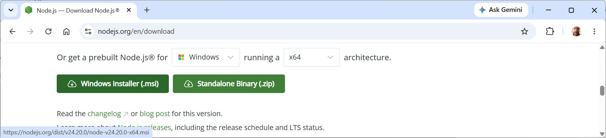

# Download and install Node.js

- [Download and install Node.js](#download-and-install-nodejs)
  - [Install Node.js on Windows](#install-nodejs-on-windows)
  - [Install Node.js on Mac](#install-nodejs-on-mac)
  - [Install Node.js on Linux](#install-nodejs-on-linux)
  - [Confirm the installation worked](#confirm-the-installation-worked)
  - [Check the result](#check-the-result)


**Node.js** lets you run JavaScript outside a web browser, which many app-building tools, including Claude Code, need on your computer to work. This guide walks you through downloading and installing it on Windows, Mac, and Linux.

You need a computer connected to the internet and permission to install software on it. By the end, you'll have Node.js and its companion CLI tool, `npm`, ready to use from a terminal.

> **Good practice**: Install the LTS (Long Term Support) version rather than the Current version. LTS releases change less often and are the version most tools expect.

## Install Node.js on Windows

Follow these steps to install Node.js using the official Windows installer:

1. Open your browser and go to https://nodejs.org.
2. Select the latest **LTS** version and then select the **Windows Installer (.msi)** button. This downloads a file ending in `.msi`.



3. Open the downloaded `.msi` file to start the installer.
4. Click **Next**, accept the license agreement, and click **Next** again.
5. Leave the default installation folder selected, and click **Next**.
6. Leave the default features selected, and click **Next**.
7. Click **Install**, then approve the prompt asking for permission to make changes to your computer.
8. Click **Finish** once the installer completes.

You should now see Node.js listed in your Start menu.

## Install Node.js on Mac

Follow these steps to install Node.js using the official Mac installer:

1. Open your browser and go to `nodejs.org`.
2. Click the button offering the **LTS** version. This downloads a file ending in `.pkg`.
3. Open the downloaded `.pkg` file to start the installer.
4. Click **Continue** through the introduction, license, and destination screens.
5. Click **Install**, then enter your Mac password when asked.
6. Click **Close** once the installer completes.

**Watch out**: If your Mac blocks the installer because it's from an unidentified developer, open **System Settings** | **Privacy & Security**, scroll to the security notice near the bottom, and click **Open Anyway**.

## Install Node.js on Linux

Linux distributions don't share one official installer, so the steps depend on which distribution you use. These steps work for Ubuntu and other Debian-based distributions, which cover most home Linux setups:

1. Open a terminal.
2. Run this command to download and run the setup script for the current LTS version:

   ```
   curl -fsSL https://deb.nodesource.com/setup_lts.x | sudo -E bash -
   ```

3. Run this command to install Node.js:

   ```
   sudo apt-get install -y nodejs
   ```

**Watch out**: Don't run a setup script from a source you don't recognize. The command above adds NodeSource's official package repository, then installs Node.js from it.

**Learn more online**: Other distributions, including Fedora, Arch, and openSUSE, each have their own recommended commands. Search your distribution's package manager documentation, or check the Node.js download page for current instructions.

## Confirm the installation worked

Open a terminal (on Windows, use Command Prompt or PowerShell) and run these two commands, one at a time:

```
node -v
npm -v
```

Each command should print a version number, such as `v24.20.0` for Node.js and a slightly lower number for npm, which installs alongside it automatically.

## Check the result

- Does running `node -v` print a version number instead of an error?
- Does running `npm -v` print a version number instead of an error?
- Did you install the LTS version rather than the Current version?

**What to ask next**: "I just installed Node.js. Can you check whether my version is current, and explain what npm is used for?"